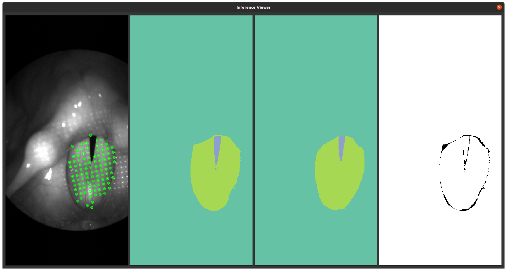

   


# \(SSSL\)²
This repository accompanies the paper **Joint Segmentation and Sub-Pixel Localization in Structured Light Laryngoscopy**.
This is a joint work of the <a href="https://www.lgdv.tf.fau.de/">Chair of Visual Computing</a> of the Friedrich-Alexander University of Erlangen-Nuremberg and the <a href="https://www.hno-klinik.uk-erlangen.de/phoniatrie/">Phoniatric Division</a> of the University Hospital Erlangen. 

## Video
<a href="https://youtu.be/1iqa_wYDGq8"></a>

## Why \(SSSL\)²?
(SSSL)² := SSSLSSSL stands for **S**emantic **S**egmentation and **S**ub-Pixel Accurate **L**ocalization in **S**ingle-**S**hot **S**tructured **L**ight Laryngoscopy.
Our approach estimates a semantic segmentation of the Vocal Folds and Glottal Gap while simultaneously predicting sub-pixel accurate laserpoint positions in an efficient manner.
It is used on a per frame basis (single-shot) in an active reconstruction setting (structured light) in laryngeal endoscopy (laryngoscopy).

## Dataset
The vocal fold segmentations were integrated into the original repository and can be found <a href="https://github.com/Henningson/HLEDataset.git">here on GitHub</a>!

## Prerequisites
Make sure that you have a Python version >=3.5 installed.
A CUDA capable GPU is recommended, but not necessary.
However, note that inference times are most definitely higher, and I wouldn't recommend training a network from scratch.

## Installation
We supply a environment.yaml inside this folder.
You can use this to easily setup a conda environment using  
```conda env create -f environment.yml```
or set up a conda environment manually via:  
```
conda create --name SSSLsquared python=3.10
conda activate SSSLsquared

# Torch
pip install torch torchvision torchaudio

# Visualization, metrics, io and git-helper
pip install pyyaml gitpython imageio imageio-ffmpeg kornia matplotlib moviepy opencv-python-headless pygit2 pyqt5 pyqt-darktheme pywavelets scikit-learn scikit-image scikit-video scipy torchmetrics chamferdist tqdm

# Packages with specific versions
pip install albumentations==1.3.0 kornia==0.6.8 torchmetrics==0.10.3
```

## Pretrained Models
The five trained U-Net models can be downloaded <a href="https://faubox.rrze.uni-erlangen.de/getlink/fiC95rzuAZBzC1JjPo37uR/UNet.zip">here</a>.  
If you want the other models as well, please contact me.  
Uploading every model easily spends all of my available cloud space that I get from the university, lol. 


## Training a Network from Scratch
If your directory structure looks like the following:
```
root_dir
- SSSLsquared
- HLEDataset
```
You can train a network using the config-files inside the ```configs``` folder via:  
```python train.py --config configs/UNet/CFCM_split.yml --dataset_path ../HLEDataset/dataset/```.

## Visualizing Results

We supply a Viewer that you can use to visualize the predictions of the trained networks.
You can use it via ```inference.py```, with  
`A`: Show Previous Frame  
`D`: Show Next Frame  
`W`: Toggle Predicted Keypoints (Green)  
`S`: Toggle Ground-Truth Keypoints (Blue)  
`Scroll Mousewheel`: Zoom In and Out  
`Click Mousewheel`: Drag View.  

## Evaluating a Network
Can be done using ```evaluate.py```.

## Things to note
We are currently in the process of heavily refactoring this code. The most recent version can be found in the **refactor** branch. 
The Gaussian regression code can be found in `models/LSQ.py`. 👍

## Quantitative Evaluation and Comparison
|            | Precision :arrow_up:   | F1-Score :arrow_up:    | IoU :arrow_up:        | DICE :arrow_up:       | Inf. Speed (ms) :arrow_down: | FPS :arrow_up: |
|------------|-------------|-------------|-------------|-------------|-----------------|-----|
| Baseline   | 0.64        | 0.69        |             |             |                 |     |
| U-LSTM[8]  | 0.70 ± 0.41 | 0.58 ± 0.32 | 0.52 ± 0.18 | 0.77 ± 0.08 | 65.57 ± 0.31    | 15  |
| U-Net[18]  | **0.92** ± 0.08 | **0.88** ± 0.04 | **0.68** ± 0.08 | **0.88** ± 0.02 | 4.54 ± 0.03     | 220 |
| Sharan[21] | 0.17 ± 0.19 | 0.16 ± 0.17 |             |             | 5.97 ± 0.25     | 168 |
| 2.5D U-Net | 0.90 ± 0.08 | 0.81 ± 0.05 | 0.65 ± 0.06 | 0.87 ± 0.02 | **1.08** ± 0.01     | **926** |


you can train a network using the supplied config files in the ```configs``` folder.
For example
```python train.py --config configs/UNet/CFCM_split.yml --dataset_path ../HLEDataset/dataset/```


## Citation
Please cite this paper, if this work helps you with your research:
```
@InProceedings{HenningsonSegAndLocalize2023,
author="Henningson, Jann-Ole
and Semmler, Marion
and D{\"o}llinger, Michael
and Stamminger, Marc",
title="Joint Segmentation and Sub-pixel Localization in Structured Light Laryngoscopy",
booktitle="Medical Image Computing and Computer Assisted Intervention -- MICCAI 2023",
isbn="978-3-031-43987-2"
}
```
A PDF is included in the `assets/` Folder of this repository.